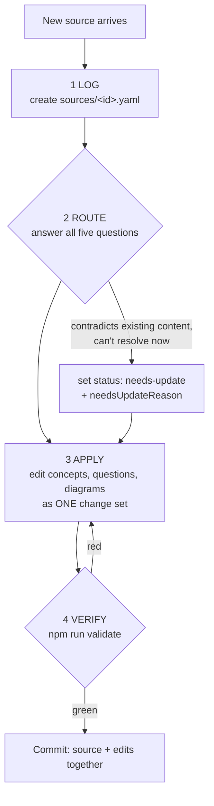

# Knowledge Intake — the runbook

Run this workflow for **every** new source (video, paper, repo, article, note, talk).
It exists so that nothing you learn ever ends up as a loose note: every piece of
information either lands in a collection or is explicitly declined — with the decision
recorded. An intake that ends with information outside a collection is an incomplete
intake. There is no notes directory, by design (plan §11, ADR-0002).



## Step 1 — LOG

Create `src/content/sources/<kebab-id>.yaml`:

```yaml
type: video            # video | paper | repo | article | note | talk
title: "…"
url: "https://…"       # omit if none
ingestedAt: 2026-07-13
routedTo: []           # filled in step 2
decisions: ""          # filled in step 2 — schema REJECTS an empty entry with no routing
```

The schema enforces "no loose ends" mechanically: a source with empty `routedTo` AND
empty `decisions` fails the build.

## Step 2 — ROUTE (the five questions)

Answer **all five**, and record the answers in the entry's `decisions` field. "No" is a
valid answer; an unanswered question is not.

| # | Question | If yes → |
|---|---|---|
| 1 | Which existing concepts does it update? | list them in `routedTo`; edit them in step 3 |
| 2 | Does it justify a **new** concept? | create it (a `stub` is enough) + assign its layer; add to `routedTo` |
| 3 | Does it **contradict** existing content? | fix it now, or set `status: needs-update` + `needsUpdateReason` on the affected concept — a visible debt marker, never a silent note |
| 4 | What does it contribute to the **interview bank**? | add/extend questions (see AUTHORING.md for the package rules) |
| 5 | Does it suggest an **experiment or visualization**? | note it in `decisions`; open it as a task if concrete |

Routing judgment: the essentiality layer is the pruning tool. Fashionable things enter
at the rim (`framework-abstraction`, `vendor-specific`) and must earn their way inward —
a hot new framework is a rim stub, not a `core-mechanism` rewrite.

## Step 3 — APPLY

Make all the edits from step 2 as **one reviewable change set** (source entry + content
edits in the same commit). Keep the fixture-labeling rule: anything that isn't finished
educational content gets a visible note. Diagram updates are data edits (ADR-0004), not
redrawings.

## Step 4 — VERIFY

```
npm run validate   # schema → graph → template → graph.json
```

Green means the new material is structurally connected and every `complete` claim still
holds. Red findings each carry a `fix:` line — resolve them top-down (schema first).
Never silence a finding by weakening content (docs/AUTHORING.md).

## Worked example

The ledger's first entry is a real one:
[`karpathy-lets-build-the-gpt-tokenizer.yaml`](../src/content/sources/karpathy-lets-build-the-gpt-tokenizer.yaml)
— routed to `tokens`, contributed the letter-counting interview follow-up, and
suggested the BPE merge visualization that becomes the Tokens playground.
